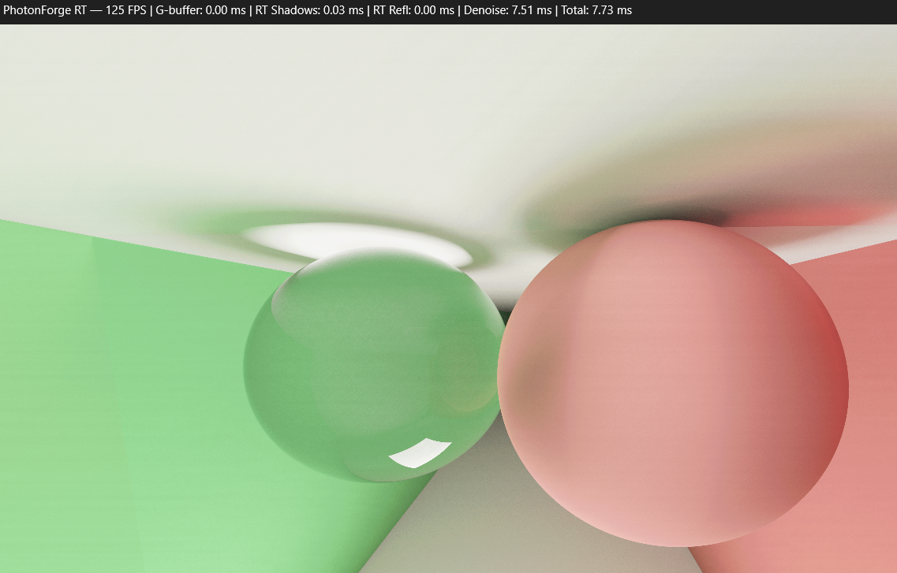

# PhotonForge RT — Real-Time Path Tracer (wgpu / WGSL)

**PhotonForge RT** is a lightweight real-time renderer written in Rust with [wgpu](https://github.com/gfx-rs/wgpu).  
It demonstrates progressive path tracing in compute shaders (WGSL), supporting diffuse, mirror, and glass materials,  
with live performance metrics in the window title.

---

## ✨ Features

- **Progressive path tracing** in WGSL compute
- **Materials**: diffuse, perfect mirror, dielectric (glass/refraction via Schlick + Snell)
- **Lighting**: point light with hard shadows + sky gradient
- **Progressive accumulation** (reduces noise over frames)
- **Controls**:  
  - WASD + QE for movement  
  - Mouse drag to rotate camera  

- **HUD**: window title shows FPS + per-pass timings (CPU-measured)
---

## 📊 Performance (RTX 4070 @ 1080p)

Example run: **16 SPP, 4 bounces, ~125 FPS**

